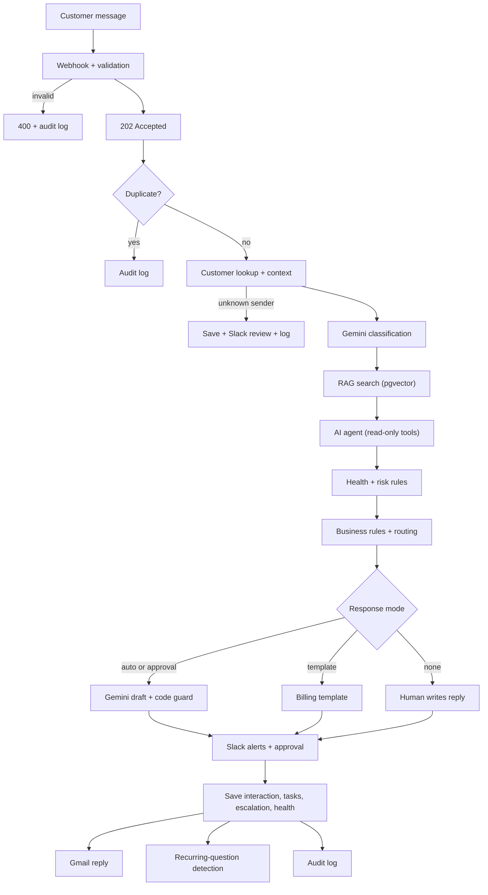

# AI Customer Success Inbound Automation & Triage System

A personal portfolio project (fictional company, fictional customers) that automates the first-response work of a Customer Success team. Inbound messages are validated, matched to a customer, classified, enriched with customer history and trusted knowledge, analyzed by an AI agent, and then routed by deterministic business rules. Risky or uncertain cases go to a human in Slack before anything is sent.

**Stack:** n8n · PostgreSQL + pgvector · Google Gemini (chat + embeddings) · Slack · Gmail

---

## Problem

Customer Success teams spend a lot of time on repetitive inbound work: reading and classifying messages, finding the customer, checking history, searching documentation, spotting unhappy or at-risk accounts, routing billing questions, and drafting replies. This project automates that work while keeping people in control of anything risky.

## Design principles

| Principle | How it is applied |
|---|---|
| AI interprets | Gemini classifies, summarizes, scores sentiment, and flags possible blockers, risks, and commercial signals. |
| RAG provides trusted knowledge | Customer-facing answers may only use retrieved knowledge documents. Documents used are recorded. |
| Agents use controlled tools | The AI agent has three read-only tools, scoped to the current customer. It cannot write, escalate, or send. |
| Rules decide what matters | Customer health, routing, escalation, and response mode are plain code, not prompts. |
| Humans handle risk | High-risk, low-confidence, and ambiguous cases need human review. Billing gets a fixed template and no AI decision. |

## Architecture



## Workflows

| Workflow | Purpose |
|---|---|
| `CS Inbound - Main` | Orchestrates the whole pipeline. |
| `CS Sub - Search Knowledge` | Embeds a query and returns the closest documents. Used by the pipeline and as the agent's `search_knowledge_base` tool. |
| `CS Sub - Write Audit Log` | Reusable audit-log writer. |
| `CS KB - Embed Documents` | One-off job that embeds knowledge documents. |
| `CS Error Handler` | Global error workflow: Slack alert plus audit row. |

## Database

Seven core tables with primary keys, foreign keys, timestamps, indexes, and CHECK constraints:
`customers`, `customer_interactions`, `customer_health`, `followup_tasks`, `escalations`, `knowledge_documents`, `automation_logs`.

Additions: `knowledge_documents.embedding` and `customer_interactions.question_embedding` (`vector(768)`), `customer_interactions.cluster_id`, and a `recurring_topics` view.

- `customer_interactions.message_id` is `UNIQUE` (duplicate protection).
- `customer_health` is a history table; `customers.health_status` holds the current value.
- Audit-log foreign keys use `ON DELETE SET NULL`, so audit records survive deletions.

## Key logic

**Request types:** Technical Support, Adoption Question, How-To / Product Guidance, Billing / Administrative, Feature Request, Account / Access, Strategic Adoption Blocker, Commercial Opportunity, General Question.

**Health rules** (can only raise risk; lowering needs a human):

| Rule | Result |
|---|---|
| Very negative sentiment + declining health | high_risk |
| Cancellation language + renewal within 90 days | high_risk |
| Cancellation language | at_risk |
| Negative sentiment + adoption blocker | at_risk |
| 3+ unresolved interactions + negative sentiment | at_risk |
| Adoption score < 40 + renewal within 90 days | at_risk |
| Adoption score < 40, or adoption blocker | watch |

**Routing priority:** escalate > csm_review > billing > human_review > commercial > adoption > standard.

**Response modes:** `auto` (low risk, confidence ≥ 0.8), `approval` (human approves in Slack), `template` (fixed billing acknowledgment), `none` (no AI draft; a human replies).

**Thresholds:** minimum confidence 0.7, auto-send confidence 0.8, RAG similarity 0.55, recurring-question similarity 0.80. These are starting values and have not been validated on real traffic.

## RAG

- 15 fictional documents: Product Guides, Customer Success Playbooks, FAQs.
- Gemini embeddings (768 dimensions) stored in pgvector, searched with cosine distance.
- A similarity threshold stops weak matches from reaching the model.
- If knowledge is needed but missing, no AI draft is produced and a human is notified.
- Document IDs used are written to the audit log.

## AI agent

Three read-only tools, scoped by the workflow so the model cannot choose a different customer:

- `search_knowledge_base`
- `get_recent_interactions`
- `get_customer_health`

Writes (tasks, escalations, Slack, customer updates) are done by normal workflow nodes after the rules run. There is deliberately no `lookup_customer` tool, because the customer is already resolved deterministically.

## Human in the loop

Slack alerts go to channels chosen by the routing rules. Drafts in `approval` mode wait in a review channel for an Approve / Disapprove decision (24-hour limit). Only an explicit approval sends the email. Rejection, timeout, or a failed approval request all end as "manual reply required" with a Slack alert.

## Error handling

| Failure | Handling |
|---|---|
| Invalid input | 400 response with error list, audit row |
| Duplicate message | Early check, audit row, no processing; `UNIQUE` constraint as a backstop |
| Unknown customer | Saved with NULL customer, Slack review alert, no auto-reply |
| AI failure / malformed JSON | Validation with safe fallback (confidence 0, human review) |
| RAG failure | Pipeline continues with `knowledge.status = failed`; no AI answer |
| Low confidence | Routed to human; no AI draft |
| Draft breaks content rules | Downgraded to `needs_review` and forced to approval |
| Slack failure | Continue on error; failure logged |
| Email failure | Interaction marked `awaiting_review`; Slack alert; audit row |
| Approval timeout | Manual-reply alert; no email sent |
| Database or other crash | Global error workflow: Slack alert with execution link, retry from n8n |

## Audit log

Each processed case writes a row to `automation_logs`: customer, event, classification, retrieved document IDs, decision, rules triggered, AI confidence, human involvement, action taken, success flag, error message, and timestamp. Failures and delivery results (email sent/failed, Slack failed) get their own rows.

## Recurring questions

Each saved question is embedded and grouped with similar questions from the last 30 days. At 3 occurrences (and every 5 after), Slack receives a rule-based recommendation: create an article, improve self-service, review with Product, or create a reusable response.

## Security notes

Implemented:
- Parameterized SQL; user text is passed as bound parameters (base64 JSON for large payloads).
- Input validation, including a restricted `message_id` and email format.
- Customer text is wrapped and treated as untrusted data in every prompt.
- Agent tools are read-only and scoped to one customer.
- Deterministic scan blocks money/commitment wording and internal terms in drafts.
- Test mode redirects all outgoing email to a single test address.
- API keys live in n8n credentials, not in workflow JSON.

Not yet done (needed before real use):
- Authentication on the webhook (e.g. Header Auth).
- A least-privilege database role (the demo uses the `postgres` superuser).
- HTTPS, rate limiting, and a data-retention policy for customer messages.

## Test scenarios

Run `scripts/e2e.ps1` (nine requests):

1. Simple product question → RAG → drafted reply
2. Low adoption → adoption blocker → follow-up task + CSM alert
3. Frustrated customer with repeated unresolved issues → escalation → human approval
4. Expansion interest → commercial follow-up task + account owner alert
5. Billing question → template + Billing Team handoff, no AI decision
6. Low-confidence question → no AI draft → human review
7. Invalid input → 400
8. Unknown sender → human review
9. Duplicate message → ignored

## Setup

1. Start PostgreSQL with pgvector: `docker run -d --name cs-postgres -e POSTGRES_PASSWORD=<password> -e POSTGRES_DB=cs_automation -p 5432:5432 pgvector/pgvector:pg16`
2. Run the SQL in `sql/` (schema, sample data, knowledge base, embedding columns).
3. In n8n, create credentials: Postgres, Google Gemini (API key), Slack (bot token), Gmail (OAuth2).
4. Import the workflows from `workflows/`. Run `CS KB - Embed Documents` once.
5. Replace the placeholder Slack channel IDs and set `TEST_RECIPIENT` to your own address.
6. Set `CS Error Handler` as the error workflow of `CS Inbound - Main`, then activate it.

## Limitations

- Fictional data only; not tested with real traffic.
- One contact email per customer.
- Replies are new emails, not threaded.
- Approval uses link buttons, so a reviewer cannot edit the draft.
- Thresholds are untuned and there are no accuracy metrics yet.
- Two identical messages arriving at the same moment can both pass the early duplicate check; the database constraint still prevents double records.
- Billing interactions stay `open` until a human resolves them, which counts toward the unresolved-interaction rule.

## Possible next steps

Webhook authentication, a Gmail trigger for real inbound email, an evaluation set for classification and retrieval accuracy, a dashboard over `automation_logs`, and threaded replies.

## Repository layout

```
README.md
sql/            schema, sample data, knowledge base, extensions
workflows/      exported n8n workflow JSON (secrets and IDs removed)
scripts/        e2e.ps1
docs/           screenshots, architecture notes
```
